  

## Sobre mí

Soy estudiante de **Tecnologías de la Información en ITSP**, orientado al desarrollo **Java y backend**. Me interesa construir soluciones completas: desde la lógica y el modelado de datos hasta interfaces web claras y funcionales.

- Actualmente trabajo con **Java, POO, SQL/MySQL y desarrollo web**.
- Estoy profundizando en **arquitectura backend, APIs y buenas prácticas**.
- Me motiva convertir problemas reales en productos que puedan demostrarse y usarse.
- Abierto a colaborar en proyectos y seguir aprendiendo con otros desarrolladores.

## Proyectos destacados

<table>
  <tr>
    <td width="50%" valign="top">
      <h3>🚘 ParkEx</h3>
      
Plataforma inteligente para visualizar en tiempo real plazas libres, ocupadas y reservadas en estacionamientos privados. Integra sensores, visión por computadora y gestión web.

      
<strong>JavaScript · Java · PostgreSQL · IoT · OCR</strong>

      <a href="https://github.com/facuduarte-dev/ParkEx">Ver repositorio →</a>
    </td>
    <td width="50%" valign="top">
      <h3>📷 Matrícula OCR</h3>
      
Lector de matrículas construido con Java, OpenCV y Tesseract. Admite imágenes, cámaras y streams, con validación por confianza y enfoque en privacidad.

      
<strong>Java · Maven · OpenCV · Tesseract</strong>

      <a href="https://github.com/facuduarte-dev/MatriculaOCR">Ver repositorio →</a>
    </td>
  </tr>
  <tr>
    <td width="50%" valign="top">
      <h3>✂️ ClipBarber</h3>
      
Aplicación web para una experiencia moderna de barbería, con interfaz responsive y despliegue público.

      
<strong>JavaScript · TypeScript · HTML · PostgreSQL</strong>

      <a href="https://clip-barber.vercel.app">Ver demo →</a> · <a href="https://github.com/facuduarte-dev/ClipBarber">Código</a>
    </td>
    <td width="50%" valign="top">
      <h3>🍕 Venancio Pizza</h3>
      
Sitio web gastronómico responsive publicado en producción, enfocado en una navegación simple y una presentación visual directa.

      
<strong>HTML · CSS · Web responsive</strong>

      <a href="https://venancio-pizza.vercel.app">Ver demo →</a> · <a href="https://github.com/facuduarte-dev/venancio-pizza">Código</a>
    </td>
  </tr>
</table>

## Tecnologías

## Actividad

  
  

  

---

  <strong>Construyendo, aprendiendo y mejorando un commit a la vez.</strong>

